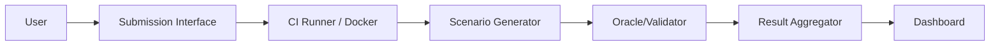

# Purpose of the Prototype Section

The goal is to demonstrate that the judge-grade requirements (REQ-1 to REQ-7) can be operationalized, that a minimal end-to-end Robotics Online Judge pipeline is feasible, and that the architecture is modular and extensible toward real robotics systems. This section serves as the feasibility proof for the blueprint.

## 1. Prototype Objectives

This prototype implements a minimal Robotics Online Judge pipeline focused on an end-to-end evaluation workflow. It operationalizes REQ-1 through REQ-6, and partially addresses REQ-7. The system currently evaluates algorithms within a structured grid-based robotics proxy domain (GridPath). It is a feasibility prototype and is not yet a full ROS2 or real-robot deployment.

## 2. System Architecture Overview

The system architecture relies on decoupled, modular components:

*   **Problem Registry:** A database storing versioned problems (e.g., v1.0, v1.2, v1.0-rc). The registry defines test tiers (Easy, Medium, Hard) and manages metadata such as environment dimensions and obstacle families.
*   **Submission Interface:** A web frontend permitting file upload (Python solver scripts). The interface exposes configurations for seed range iteration and asynchronous runtime limits.
*   **Execution Engine:** An isolated infrastructure utilizing Docker-based execution and a headless CI execution path. An isolated sandbox runner executes untrusted code with enforced system constraints.
*   **Scenario Generator:** A module responsible for seeded generation of topological grids and tier-based test selection prior to execution.
*   **Oracle / Validator:** A distinct mathematical module executing after the scenario. It manages path validation, metric computation, and acceptance rule mapping based on the solver's JSON output matrix.
*   **Result Store:** A PostgreSQL relational schema handling historical storage of per-seed metrics and aggregated result sets.
*   **Dashboard:** A user interface displaying the evaluation verdict, aggregate success rate, P95 runtime, mean cost, and a granular per-seed breakdown linked to raw artifact logs.

### Architecture Diagram

## 3. Execution Pipeline

The execution lifecycle operates linearly to ensure deterministic outcomes:

1.  **Ingress:** A submission via the interface or CI script triggers an asynchronous job.
2.  **Provisioning:** An ephemeral Docker container is instantiated with strict CPU and memory limits.
3.  **Iteration:** The system iterates over the configured seed range bounds.
4.  **Per-Seed Execution:** For each discrete seed:
    *   The Scenario Generator writes the deterministic `case.json` topology.
    *   The solver is executed via a sandboxed sub-process.
    *   System execution metrics (wall-clock time, peak memory) are collected.
5.  **Validation:** The Oracle parses the solver output (`path.json`) to compute cost and geometric legality.
6.  **Aggregation:** Metrics across all seeds are statistically aggregated (e.g., computing the P95 runtime and success rate).
7.  **Finalization:** A final deterministic verdict (e.g., AC, WA, TLE) is computed, and results are committed to the Result Store and displayed on the Dashboard.

Determinism is controlled by explicitly linking solver execution to injected random seeds. Failures at any stage (e.g., a timeout or memory crash) halt the specific seed execution, return an error code log artifact, and aggregate into the overall suite failure rate.

## 4. Requirement Coverage Mapping

The prototype directly maps to the defined requirements:

*   **REQ-1: Container-first execution.** Implemented via Docker runner. The system instantiates an unprivileged, isolated sandbox container for each execution, preventing access to the host server.
*   **REQ-2: Seed governance.** Implemented via the Submission Interface allowing explicit seed range configuration. Success rates and costs are calculated across the range, supported by a per-seed breakdown table.
*   **REQ-3: Scenario–Oracle separation.** Implemented via separate module architectures. The scenario generation script executes prior to the solver, while the validator script (Oracle) executes post-run to verify the output against the generated grid schema.
*   **REQ-4: Statistical verdicts.** Implemented via the aggregator module. The system computes cross-seed mathematical averages and explicitly exposes the 95th Percentile (P95) execution runtime and average path cost metrics.
*   **REQ-5: Artifact traceability.** Implemented via the Result Store. The system manages testcase versioning and stores all testcase JSON logic, container paths, output artifacts, and relational metrics historically in PostgreSQL.
*   **REQ-6: Resource/time constraints.** Implemented via the Execution Engine. The sandbox enforces strict asynchronous runtime limits (producing TLE verdicts) and utilizes `psutil` to record and restrict maximum memory usage.
*   **REQ-7: Safety constraints.** Partially achieved. The Oracle executes kinematic bounds checking (prohibiting impossible infinite-acceleration 180-degree grid inversions). Full physical momentum simulation requires future robotics integration.

### Requirement Implementation Matrix

| Requirement | Supported | Evidence |
| :--- | :--- | :--- |
| REQ-1 | Yes | Docker runner |
| REQ-2 | Yes | Seed range + breakdown |
| REQ-3 | Yes | Separate generator/validator stages |
| REQ-4 | Yes | Aggregated multi-run metrics |
| REQ-5 | Yes | Logs + stored metrics |
| REQ-6 | Yes | Timeout + runtime tracking |
| REQ-7 | Partial | Kinematic limits implemented; planned robotics safety module |

## 5. Limitations and Roadmap

### Prototype Limitations
*   The evaluation environment is currently simplified to a 2D structured grid proxy domain.
*   There is no direct adapter layer to ROS2.
*   The system lacks real-robot hardware integration.
*   Safety enforcement is limited to structural collisions and simplistic kinematic inversions.
*   System scalability and parallel queue throughput have not yet been formally benchmarked.

### Future Roadmap
*   Development of a native ROS2 adapter layer to ingest standard sensor streams.
*   Integration with 3D physics engines such as Webots or Gazebo.
*   Inclusion of a hardware-in-the-loop tier for real-robot deployment testing.
*   Expansion of the safety constraint enforcement module to handle complex real-world momentum and sensor limits.
